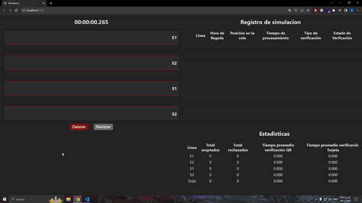

# Residential Complex Simulation

## Overview

This project simulates the entrance to a residential complex, providing a visual representation of the entry process for vehicles. The user interface is built using React, offering an interactive and user-friendly experience. The simulation includes features such as real-time visualization, multiple verification methods (QR code and card), and detailed statistics.

The backend API is implemented using Flask, allowing communication between the frontend and the simulation engine.

## Table of Contents

- [Demo](#demo)
- [Features](#features)
- [Getting Started](#getting-started)
  - [Prerequisites](#prerequisites)
  - [Installation](#installation)
- [Usage](#usage)

## Demo



## Features

- **Real-time Simulation**: Visualize the entry process with a real-time simulation.
- **Multiple Verification Methods**: Simulate both QR code and card verification for vehicles.
- **Statistics**: Track and display statistics regarding accepted and rejected vehicles, average verification times, and more.
- **User-friendly Interface**: A React-based UI provides an intuitive and responsive user experience.

## Getting Started

Follow these instructions to set up and run the simulation on your local machine.

### Prerequisites

- [Node.js](https://nodejs.org/) installed on your machine.
- [Python](https://www.python.org/) installed on your machine.

### Installation

1. Clone the repository.

   ```bash
   git clone https://github.com/AngelBelmares/simulation-project.git

2. Navigate to the project directory.

    ```bash
    cd simulation-project

3. Install dependencies.

    ```bash
    npm install

4. Navigate to the server folder.

   ```bash
   cd server

5. Install Python dependencies.

   ```bash
   pip install Flask flask-cors numpy

### Usage

1. Start the development server.

    ```bash
    npm run dev

2. Start the flask API
ㅤ
   ```bash
   cd server
   python app.py
ㅤㅤ
ㅤ
